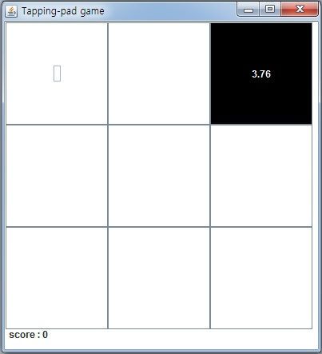

# Tapping_pad_game

#### Tapping Pad는 JAVA로 작성된 미니 게임입니다.
#### 화면은 JFrame GUI를, 게임 동작에는 Thread 등을 이용하여 제작하였습니다.

사용자는 메인 화면에서 3가지 버튼(Game Start, See Ranking, Exit)을 이용하여 각 기능들을 수행할 수 있습니다.

***

먼저 사용자가 Game Start 버튼을 눌렀을 때 동작입니다.

9개의 Pad 중, 하나의 Pad가 랜덤으로 검은색으로 변하고, Pad 안의 시간이 점점 줄어듭니다.

이 때, 시간이 되기 전 사용자가 Pad를 클릭하면, Score가 오르고 다른 랜덤 Pad가 다시 검정색으로 변하게 됩니다

Score에 비례하여, Pad의 시작 시간은 점차 줄어들고, 결국 0.5초까지 줄어들게 됩니다.

동작의 핵심 코드는 다음과 같습니다

9개의 Pad는 각각 JButton 객체로 선언되어, ActionListener를 이용해 마우스 클릭을 읽어옵니다.

마우스 클릭이 들어오면, 위의 코드에서 JButton의 번호를 알아내고, 일련의 동작을 수행하게 됩니다.

그와 동시에, 위의 thread가 같이 돌아가며 0.1초 마다 시간을 count하고, 출력합니다.

게임이 끝나면, Game Over화면이 출력되고, 2가지 버튼(Restart, Go Title)과 함께 사용자의 score가 출력됩니다.

동작의 핵심 코드는 다음과 같습니다

